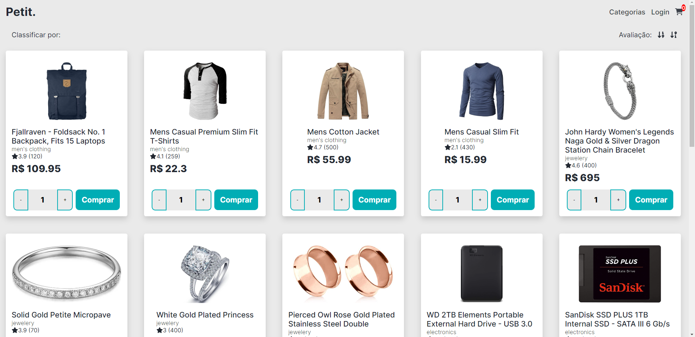

# Desafio Ide@l - E-commerce

Site de E-commerce desenvolvido baseado em uma API.

Feito com Vue.js, na arquitetura SPA.

## Repositório

Para ver o histórico do código, vá para o repositório usado no desenvolvimento do projeto

[Repositório](https://github.com/igutzzz/ecommerce-vue)

## Autor

- [@igutzzz](https://www.github.com/igutzzz)

## Funcionalidades

- Definir a quantidade de itens que serão adicionados no carrinho
- Ver o item no carrinho, podendo alterar a quantidade pelo próprio carrinho
- Ordenar os produtos pela classificação (crescente e decrescente)
- Exibir o valor total da compra, atualizado em tempo real ao manipular o carrinho
## Screenshots

