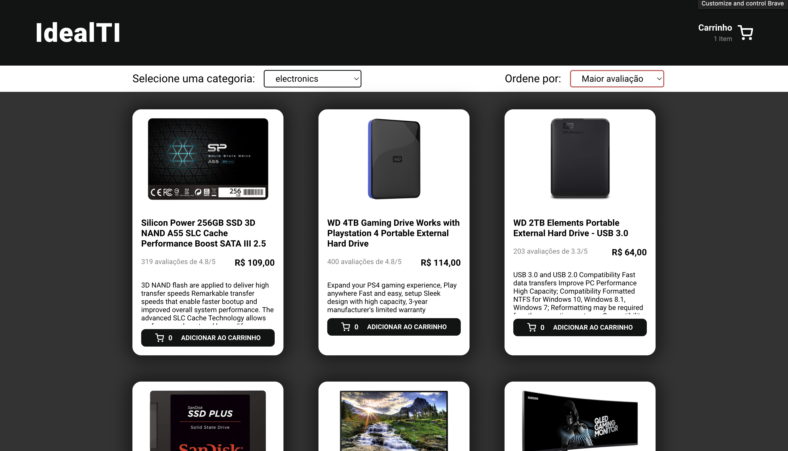
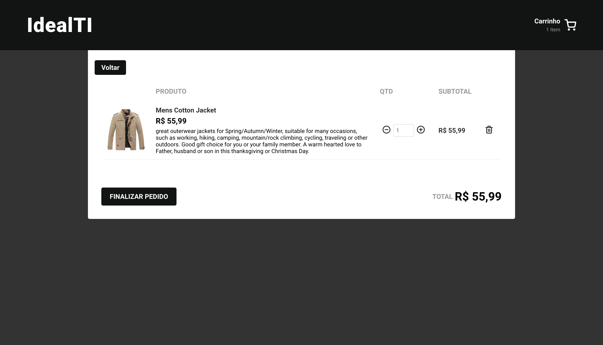
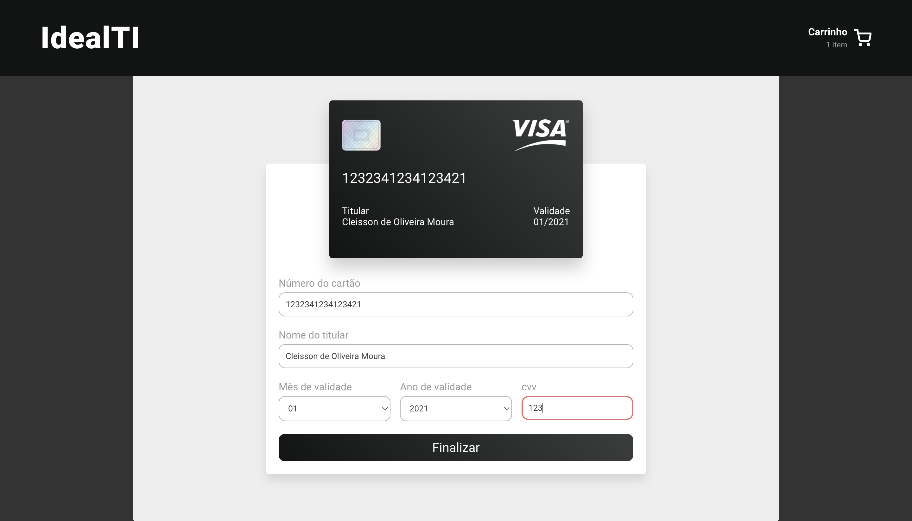

## Vue3 ( SFC + CompositionAPI + script-setup )
## TypeScript + Vite + Pinia + vue-router + Vitest + Vue Testing Library + Docker
- Aprendi bastante com esse desafio!

## Detalhes
- Para criar um e-commerce com a melhor performance, eu utilizaria Nuxt, mas neste desafio utilizei Vue.js demostrando as funcionalidades de um e-commerce assim como foi requerido
- Projeto iniciado com Vite.js, com template vue-typescript
- Busquei implementar uma melhor estrutura na aplicação, seguindo boas práticas, com objetivo de melhorar a legibilidade do código e sua manutenção
- Otimizei ao máximo para a aplicação fazer a menor quantidade de requisições à API possível, porém, sempre em mente a não dependência da API fornecida, criando estrutura que pode facilmente se adaptar à outras APIs
- Utilizei o pré-processsador SCSS
- Usei axios para controlar chamadas API
- Criei rotas home, cart e checkout, com header e filtros estáticos, utilizando vue-router
- Formatei todos os preços para padrão R$
- Adicionei filtros para todas as categorias fornecidas pela API e ordenação por preço e avaliação 
- Pinia para gerenciamento e compartilhamento de estado, utilizando localStorage para salvar informações do carrinho
- Docker para conteinerização da aplicação
- Testes unitários e componentes com Vitest(similar ao Jest) e Vue Testing Library

## Instruções
- **Instale as dependencias**
  `yarn` ou `npm install`

- **Rode o Projeto em ambiente de desenvolvimento**
  `yarn dev` ou `npm run dev`

- **Crie o Build do projeto**
  `yarn buil` ou `npm run build`

- **Visualize o preview do projeto**
  `yarn preview` ou `npm run preview`

## IDE Setup
- [VS Code](https://code.visualstudio.com/) + [Volar](https://marketplace.visualstudio.com/items?itemName=Vue.volar)

## Images Preview

- ### HomePage

- ### CartPage

- ### CheckoutPage
