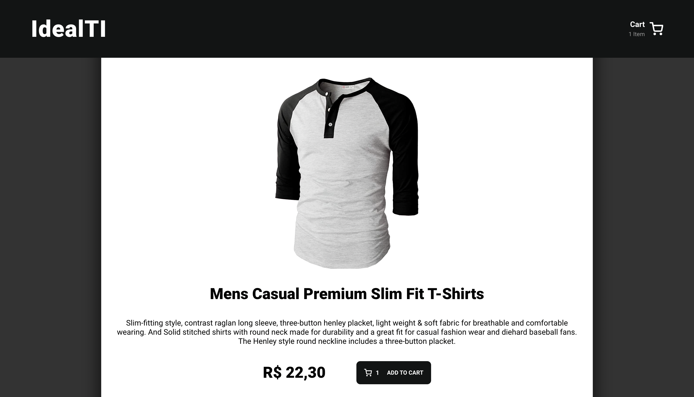

### Vue3 ( SFC + CompositionAPI + script-setup ) + TypeScript + Vite + Pinia + vue-router + Vitest + Vue Testing Library + Docker
- Aprendi bastante com esse desafio! Aprendi muitas coisas e detalhes no ambiente VueJs, principalmente o controle e gerenciamento de estado de um hook. Também aprendi bastante sobre o Docker e testes(algo que quero melhorar e aprender MUITO). Sinto que esse foi só um começo nessa jornada de aprendizado e me sinto ansioso de poder enfrentar novos desafios com a equipe da Ide@l!
   - obs: Uma das melhores partes foi quando eu fiquei encalhado em um problema/erro kkkkkk O perrengue é ruim, mas quando a gente resolve a sensação é ótima e essa é a recompensa

---

## ☁️ Deploy
- Fiz o deploy utilizando [Vercel](https://vercel.com/), podem conferir neste [link](https://ideal-store.vercel.app/)

## 📝 Detalhes
- Para criar um e-commerce com a melhor performance, eu utilizaria Nuxt, mas neste desafio utilizei Vue.js demostrando algumas das funcionalidades de um e-commerce
- Projeto iniciado com Vite, com template vue-typescript
- Busquei implementar uma melhor estrutura na aplicação, seguindo boas práticas, com objetivo de melhorar a legibilidade do código e sua manutenção
- Otimizei ao máximo para a aplicação fazer a menor quantidade de requisições à API possível, porém, sempre em mente a não dependência da API fornecida, criando estrutura que pode facilmente se adaptar à outras APIs
- Utilizei o pré-processsador SCSS
- Usei axios para controlar chamadas API
- Criei rotas home, product, cart e checkout, com header estático, utilizando vue-router
- Formatei todos os preços para padrão R$
- Adicionei filtros para todas as categorias fornecidas pela API e ordenação por preço e avaliação 
- Pinia para gerenciamento e compartilhamento de estado, utilizando localStorage para salvar informações do carrinho
- Docker para conteinerização da aplicação
- Testando o hook com Vitest(similar ao Jest) e Vue Testing Library

## ⚙️ Instruções

- **Rode a Image da aplicação em um Docker Container**  
   `docker run -it -p 3000:3000 cleissonom/desafio03-vueapp:1.4.0`

#### OU

- **Instale as dependencias**  
  `yarn` ou `npm install`

- **Rode o Projeto em ambiente de desenvolvimento**  
  `yarn dev` ou `npm run dev`

- **Crie o Build do projeto**  
  `yarn buil` ou `npm run build`

- **Visualize o preview do projeto**  
  `yarn preview` ou `npm run preview`

## 🗓 To-Do
- Adicionar um Checkout completo, com integração com alguma API de pagamentos
- Coleta de informações do usuário, como endereço de entrega
- Testar Views e Components
- Implementar testes E2E com Cypress

## 🧰 IDE Setup
- [VS Code](https://code.visualstudio.com/) + [Volar](https://marketplace.visualstudio.com/items?itemName=Vue.volar)

## 📷 Images Preview

- ### HomePage

- ### ProductPage

- ### CartPage

- ### CheckoutPage
