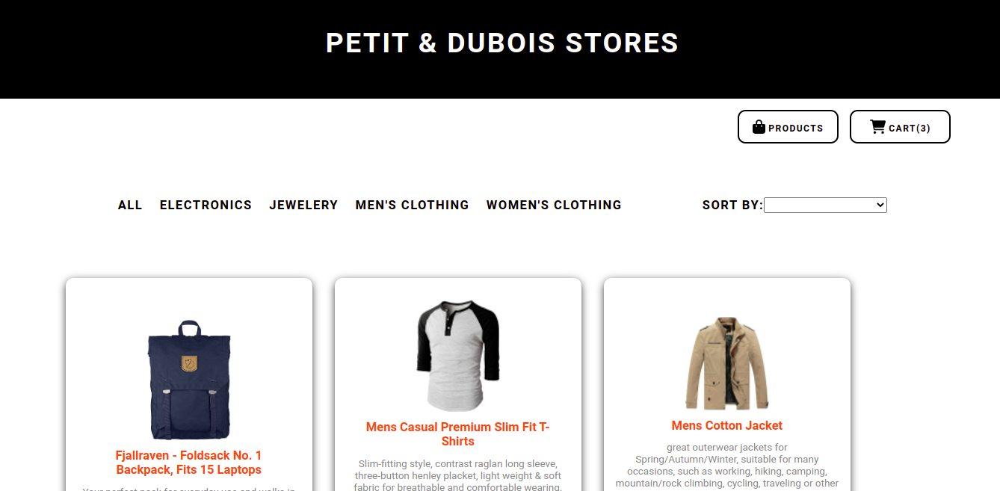

<h1 align="center">Desafio Ide@al TI</h1>

<div align="center">
  

  <p>This project is a challenge from Ide@al TI. It consists of creating a virtual store using the products registered in the Fake Store API. In the project we can see all products with name, description, image and unit value, filter by category and sort by price, grade or alphabetical order. It is also possible to add products to a cart and on the cart page view the total purchase amount and the products that will be purchased.</p>
  
  
  <h1 color="Blue">🚀 Technologies</h1>

This project was developed with the following technologies:

- [x] VueJs
- [x] Axios
- [x] Font Awesome


  <h1 color="Blue">🚀 How to use</h1>


To clone and run this application, you'll need Git, Node.js and NPM installed on your computer. From your command line:

```
# Clone this repository
$ git clone https://github.com/allesonbarbosa/alleson-barbosa.git

# Go into the repository
$ cd desafio-idealti

# Install dependencies
$ npm install

# Run the app
$ npm run dev
```
  <h1 color="Blue">🤝 Contributors</h1>

We thank the following people who contributed to this project:

<table>
  <tr>
    <td align="center">
      <a href="https://www.linkedin.com/in/alleson-de-moura-barbosa-193802210/">
        <br>
        <sub>
          <b>Alleson Barbosa</b>
        </sub>
      </a>
    </td>
  </tr>
</table>

</div>
